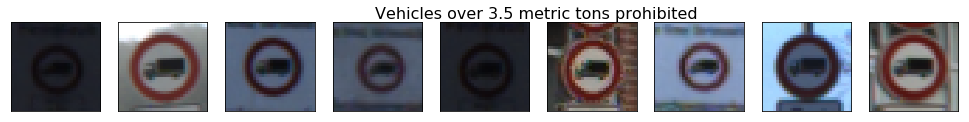

## Deep Learning: Traffic Sign Recognition

The goals of this project are the following:
* Load the data set
* Explore, summarize and visualize the data set
* Design, train and test a model architecture

### Data Set Summary & Exploration

#### 1. Basic summary of the data set

I used the numpy library to calculate summary statistics of the traffic
signs data set mainly using the shape function:

Dataset sizes and shapes:
| Size of training set | 34799 |
| Size of the validation set | 4410 |
| Size of test set | 12630 |
| Shape of a traffic sign image | 32x32 Pixel (with 3 color channels). |
| Unique classes/labels? | 43 (staring with ClassId 0, ending with ClassId 42). |

#### 2. Visualization of the dataset.

Here is an exploratory visualization of the data set. The following Figure cleary shows that the dataset provides an unequal number of training samples for every class:

First I plotted sequences of images and noticed that they were probably recorded from a sequence of a car driving by. Subsequently, to get a better overview of the rest of the dataset I picked four random images from each dataset repeatedly. Some examples are shown below:
 
 
 

          

The most relevant observations are:
1. Some of the traffic signs are blurry
2. Most of them are very dark or overexposed
3. There are unequal number of traffic sign images for the different classes

### Design and Test a Model Architecture

#### 1. Describe how you preprocessed the image data. What techniques were chosen and why did you choose these techniques? Consider including images showing the output of each preprocessing technique. Pre-processing refers to techniques such as converting to grayscale, normalization, etc. (OPTIONAL: As described in the "Stand Out Suggestions" part of the rubric, if you generated additional data for training, describe why you decided to generate additional data, how you generated the data, and provide example images of the additional data. Then describe the characteristics of the augmented training set like number of images in the set, number of images for each class, etc.)

I decided to generate additional data because the testdata provided an unequal number of testdata for each class. To add more data to the the dataset, I used the following techniques:
- Pick random image from class with less training samples
- Slightly scale the image up by a random factor (below 15 Percent)
- Slightly rotate the image by a random angle
- Add noise to the image (removed in final version)

Here is an example of an original image and an augmented image:

 

The difference between the original data set and the augmented data set is shown in the following histogram. 

I am aware that this is not the best solution regarding that the small quantities of training data of some classes will lead to almost identical augmented images. Best solution would be to simply collect more images on the street. But the augmented dataset made the convnet meet the requirements. It could also be useful to decrease the number of examples for the class with the maximum number of examples to make the dataset more symmetric.

As preprocessing, I converted the image to grayscale and subsequently normalized them.
I chosed to grayscale the images because the color channel does not seem to have a significant impact on the classification result (experimentally evaluated). Here is an example of a traffic signs sequence in grayscale:

 

Subsequently, I normalized the images and set the mean to zero.

####2. Model Architecture

My final model consisted of the following layers which represents the classic LeNet Architecture as introduced in the course

| Layer         		|     Description	        					| 
|:---------------------:|:---------------------------------------------:| 
| Input         		| 32x32x3 Gray image   							| 
| Convolution 5x5     	| 1x1 stride, valid padding, outputs 28x28x6 	|
| RELU					|												|
| Max pooling	      	| 2x2 stride,  outputs 14x14x6 				|
| Convolution 5x5	    | 1x1 stride, valid padding, outputs 10x10x16      									|
| RELU					|												|
| Max pooling	      	| 2x2 stride,  outputs 5x5x16 				|
| Fully connected		| outputs 120
| RELU					|												|
| Fully connected		| outputs 84
| RELU					|												|
| Fully connected		| outputs 42

####3. Model Training

I used the AdamOptimizer with 30 epochs and a batch size of 128. The learning rate has been set to 0.001

####4. Results
I started with the leNet architecture and dataset normalization. The initial architecture only got an accuracy of about 90%, the input data set provided an unequal number of examples for different classes. The learning rate has been reduced, and the number of epochs has been increased, until it seems that there are no significant improvements anymore after epoch 25. The most dominant improvement could be achieved by augmenting the number of training examples.

My final model results were:
* training set accuracy of 0.996
* validation set accuracy of  0.941
* test set accuracy of 0.926

Comparing the accuracy of the training set with the achieved accuracy of the test set, the model seems not to over or underfit the training data set.
